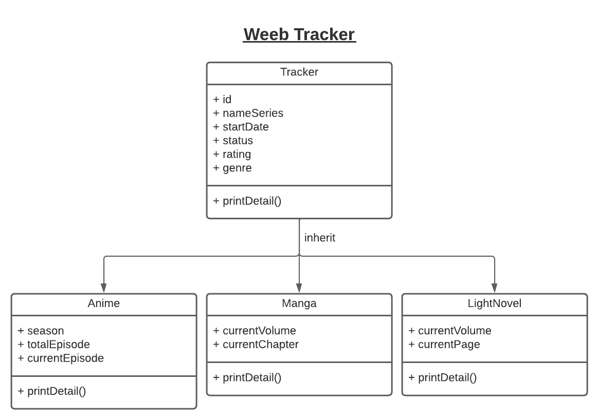

# Project Java OOP Before UTS

Mata kuliah : Object Oriented Programming

Kelas : __LG01-LEC__

Anggota Kelompok : 
- 2440092151 - Daniel Widjaja
- 2440036882 - Derrick
- 2440030683 - Muhammad Fathariq Dimas Octaviandra

## Description

Aplikasi yang kami buat adalah _**Weeb Tracker**_ yaitu aplikasi console untuk tracking progress menonton **anime** atau membaca **manga**. 
Selain itu, dalam aplikasi ini kita dapat menyimpan list anime yang akan ditonton kedepannya dan juga melihat history anime yang kita pernah saksikan.

## Class Diagram

Berikut adalah class diagram dari aplikasi

